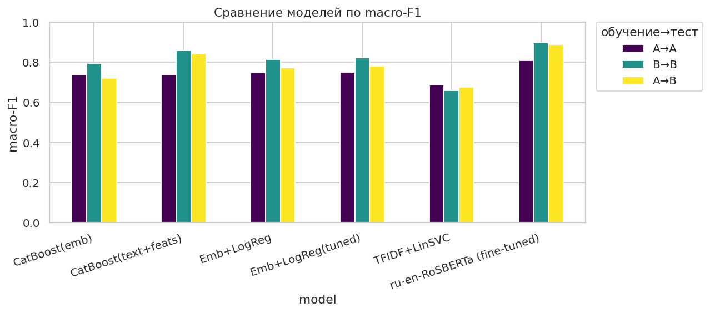
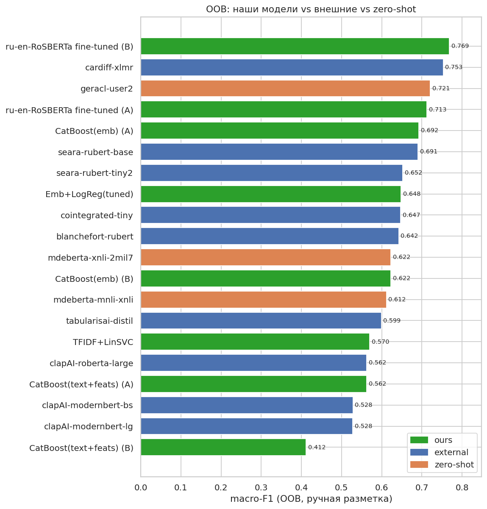

# Обучение моделей для анализа тональности русскоязычных текстов

Проект подготовлен с использованием Cursor (режим Agent, модель Opus 4.8 Max; https://cursor.com). Полная информация о взаимодействии с ИИ-агентом доступна в файле с логами единственного чата, задействованного для реализации проекта: [`cursor_chat_logs.md`](cursor_chat_logs.md). В сгенерированном коде вручную исправлены только сетка гиперпараметров для файн-тюнинга и число итераций случайного поиска (файл [`src/finetune.py`](src/finetune.py)).

Файл [`target.md`](target.md) представляет собой описание учебного проекта, файл [`datasets_sources.md`](datasets_sources.md) – ссылки на найденные мною датасеты для сентимент-анализа на русском языке в разбивке по источникам данных.

Также по результатам проекта я самостоятельно подготовил краткое резюме (представлено ниже). Дополнительная информация о проекте представлена в README после резюме (разделы «Данные», «Предобработка и признаки», «Модели», «Результаты», «Воспроизведение», «Структура проекта») и доступна в ноутбуке [`sentiment_analysis.ipynb`](sentiment_analysis.ipynb) (текст подготовлен ИИ-агентом, перепроверен мной с исправлением мелких неточностей и небольшими дополнениями).

## Резюме по разделам ноутбука

**Часть 1. EDA**

**1)** У нас есть три типа происхождения меток тональности (негативная / нейтральная / позитивная): rating, distant, human. Первый (rating) получен на основе маппинга оценки в отзыве (на товар / фильм…) по пятибалльной шкале: негативная метка – это оценки 1 и 2, нейтральная – 3, позитивная – 4 и 5. Такого типа происхождения меток у нас больше всего. Второй тип происхождения меток по встречаемости в общем корпусе (distant) – это автоматически размеченный датасет RuTweetCorp. Наконец, третий, наименее встречаемый, но наиболее достоверный (human) – это человеческая разметка.

**2)** На основе данных типов происхождения меток создается два варианта (сценария) обучения моделей. Вариант A – все источники (1,37 млн наблюдений с очень сильным дисбалансом классов в сторону позитивного), вариант B – без rating-меток (282 тыс. наблюдений с доминацией distant-типа без нейтрального класса). Тем не менее для оценки точности в качестве основной далее используется метрика F1-макро, которая не дискриминирует менее встречаемые классы в выборке, в отличие от F1-взвешенной или Accuracy.

**3–4)** Выбросов по текстовым признакам немного, больше всего (около 10%) по числу символов и слов в тексте, но это не проблема, поскольку в данном случае выбросы есть только «сверху», а обрезку текстов в рамках моделей-трансформеров можно автоматически контролировать при помощи соответствующего гиперпараметра (значения которого я добавил в сетку перебора при файн-тюнинге).

**5)** Проверим несколько гипотез о потенциальной полезности текстовых признаков для классических моделей машинного обучения. ИИ-агент верно заметил, что при очень больших выборках любой эффект будет статистически значим, поэтому при проверке гипотез надо смотреть на размер эффекта, а не на p-value. Так, медианные длины позитивных и негативных текстов приблизительно равны, нейтральные тексты содержат существенно меньше восклицательных знаков, чем позитивные и негативные, доля капса в позитивных текстах не меньше, чем в негативных, и, наконец, тональность текста во многом детерминируется доменом его происхождения. Эти выводы учтены при обучении одной из вариаций бейзлайн-моделей (CatBoost).

**6)** Смотря на распределение тональностей по доменам и учитывая, что нейтральный класс по-разному определен в разных источниках, ожидается, что он может оказаться наиболее проблематичным для распознавания моделями.

**7)** Проведена дедупликация данных в целях избежания data leakage.

**Часть 2. Эмбеддинги и кластеризация**

**1)** Проведен базовый sanity-check эмбеддингов. Для примера взят энкодер deepvk/USER-bge-m3 (не самый тяжелый из тех, что используются в проекте, но и не самый легкий). Косинус центроидов L2-нормированных эмбеддингов позитивного и негативного класса равен примерно 0,77 (что свидетельствует о достаточно неплохой разделимости двух полярных тональностей по эмбеддингам), нейтрального и двух других классов – 0,86-0,96 (подтверждает выводы из п. 6 раздела EDA). Кроме того, доля пяти ближайших соседей объекта, у которых тот же класс, что и у него самого (по подвыборке 30 000 текстов в пространстве эмбеддингов) составляет 0,85; а у случайных «соседей» – 0,61, поэтому близкие в пространстве эмбеддингов тексты действительно гораздо чаще принадлежат к одной тональности, чем при случайном распределении. Соответственно, эмбеддинги являются хорошими признаками для решения нашей задачи классификации.

**2)** При этом KMeans на эмбеддингах задачу не решает, судя по очень низкому ARI – adjusted Rand index. Если визуализировать стратифицированную по доменам подвыборку текстов в 2d-UMAP-пространстве, то заметно, что домен является более важной детерминантой местоположения точки на графике, чем тональность (которая, в свою очередь, отвечает за локальное расположение точки внутри домена, и то это далеко не везде явно прослеживается на 2d-визуализации). Если учесть это и вспомнить, что KMeans выделяет только выпуклые кластеры, то можно попробовать применить HDBSCAN. Данный метод отнес около 14% данных к шуму, сформировав 22 кластера, которые, в соответствии с UMAP-визуализацией, определяются доменной принадлежностью, а не тональностью. Следовательно, обучение без учителя не позволит добиться адекватных результатов для анализа тональности. Построим бейзлайн-решения на основе методов обучения с учителем (классификации), учитывая высокую потенциальную информативность эмбеддингов текстов.

**Часть 3. Обучение моделей и in-domain оценка точности**

Возьмем несколько типов решений и обучим их на датасетах A и B (см. п. 2 части 1). Забегая вперед, отмечу, что лучшее качество стабильно наблюдается на втором варианте конфигурации массива данных (потому что он менее шумный и имеет более адекватное качество разметки). Выбраны три варианта решения задачи анализа тональности:
* наивный бейзлайн – TF-IDF и линейная модель (LinearSVC);
* продвинутый бейзлайн – эмбеддинги, полученные в части 2, с линейной и нелинейной моделями (логистическая регрессия и CatBoost) с подбором гиперпараметров, а также CatBoost с сырыми текстами и дополнительными простейшими текстовыми признаками с подбором гиперпараметров;
* дообучение языковой модели с подбором гиперпараметров.

**1–4)** Худшим по точности бейзлайном оказался LinearSVC на TF-IDF-признаках, а лучшим – CatBoost на сырых текстах с добавлением ряда дополнительных признаков, сгенерированных из текстов. Что интересно, встроенный в CatBoost базовый алгоритм предобработки текстовых данных на базе мешка слов вместе с рядом дополнительных числовых признаков оказывается даже чуть лучше, чем использование эмбеддингов для этой же модели или для логистической регрессии. Однако это объяснимо тем, что данные методы все еще относятся к области машинного обучения, а с неинтерпретируемыми эмбеддингами лучше работают модели глубинного обучения.

**5)** Поэтому переходим к самому интересному – файн-тюнингу энкодеров. Обоснование отбора итоговых четырех моделей-трансформеров представлено после резюме в разделе «Модели», тут повторяться не буду. В сетке гиперпараметров – сам энкодер (deepvk/USER-bge-m3, deepvk/USER2-base, ai-forever/ru-en-RoSBERTa, sergeyzh/rubert-mini-frida), размер батча, learning rate и доля warmup, количество эпох, максимальная длина входного текста в токенах, коэффициент затухания весов. Число итераций случайного поиска – 128, поиск шел по датасету A. Лучшая конфигурация гиперпараметров (ai-forever/ru-en-RoSBERTa, lr = 2e-5, эпохи = 3, батч = 16, максимум токенов = 512, затухание = 0,1, warmup = 0,1) позволила добиться качества (как по F1-макро, так и по Accuracy) лучше, чем при использовании бейзлайн-решений. Финальные модели (A и B) обучались на сбалансированной подвыборке по своему датасету – не более 50 тыс. текстов на класс (андерсэмплинг доминирующих классов в пользу оптимизации F1-макро), при этом итоговая оценка качества проводилась на полном тесте (для честности).

**Часть 4. OOB-оценка точности**

**1)** Для OOB-оценки точности отобраны 12 наиболее популярных языковых моделей двух типов: дообученные для анализа тональности и для классификации без примеров (zero-shot-классификации). Все модели основаны на трансформер-архитектуре и включают от 11 до 560 млн параметров, т. е. обучаемых весов нейронной сети. Файл для OOB-тестирования [`data/combined_platform_proportional_sample.xlsx`](data/combined_platform_proportional_sample.xlsx) подготовлен мною в рамках выполнения курсовой работы: для валидации использованных в исследовании моделей создана стратифицированная выборка из 1 067 комментариев, которая репрезентирует генеральную совокупность из более чем миллиона эмоционально окрашенных текстов из соцсетей по показателям пола, города и аудитории автора комментария, дате публикации, длине, лайкам, аудитории блога и платформе («Одноклассники» или Telegram). Разметка осуществлялась по правилам аннотирования набора данных RuSentiment для трех категорий тональности (негативная, позитивная, нейтральная). Итоговое распределение классов в выборке: негативный – 44%, позитивный – 29%, нейтральный – 27% (вполне конгруэнтные значения для цифровых следов).

**2)** Наш обученный энкодер ru-en-RoSBERTa на базе датасета B показал лучшие результаты по F1-макро на данной OOB-выборке. Прирост в качестве в сравнении с топ-2 моделью (XLM-roBERTa от cardiffnlp) не является статистически значимым, но отрыв от любой другой модели – статистически значим. Остальные обученные в рамках проекта модели заметно просели в точности.

**3-4)** Наша модель на базе ru-en-RoSBERTa и датасета B лучше других распознает истинный позитивный и нейтральный класс, однако существенную часть негативных текстов по ручной разметке она относит к нейтральному классу (что было ожидаемо – см. п. 6 части 1 и п. 1 части 2 ноутбука). Пример такого комментария: *«В Вологде если автобусы на рейс просто выходят это уже счастье. Каждый день одна и та же картина, сотня человек на остановке, раз в час в лучшем случае нужный маршрут, и ни одного частного автобуса на Яндекс картах»*. Что касается т. н. domain shift, то наименьший спад точности при переносе оценки из плоскости in-domain в OOB наблюдается у CatBoost, обученного на эмбеддингах датасета A, наибольший – у CatBoost, обученного на сыром тексте и дополнительных признаках датасета B (лучшая из бейзлайн-моделей in-domain очень плохо генерализируется при OOB-оценке точности).

Таким образом, дообученный на датасете B (без наиболее шумных меток тональности) энкодер ru-en-RoSBERTa является лучшим как при оценке качества in-domain (F1-макро ≈ 0,9), так и на независимом OOB-датасете (F1-макро ≈ 0,77).

---

## Данные

Корпус собран из ~15 открытых русскоязычных датасетов (отзывы, новости, твиты,
посты) — полный список источников со ссылками: [`datasets_sources.md`](datasets_sources.md).

- **~1,37 млн** строк (после дедупликации), **24 признака**.
- `label ∈ {negative, neutral, positive}` — целевая переменная.
- `label_source_type` — происхождение метки: `human` (ручная разметка),
  `rating` (пятибалльная оценка из отзыва, приведённая к трём классам
  тональности), `distant` (автоматическая разметка RuTweetCorp).
- `domain ∈ {geo, grocery, clothing, social, news, blogs, twitter}`.
- Признаки **датасета**: текст + категориальные
  (`source`, `domain`, `label_source_type`, `category`) + числовые
  (`original_rating`, `price` и инженерные `n_chars`, `n_words`, `n_exclaim`,
  `upper_ratio`, `mean_word_len`, …). В модели подаётся только `text` (и
  выведенные из него эмбеддинги / инженерные текстовые признаки); `domain`,
  `original_rating` и прочие метаданные служат для EDA, дедупликации и деления
  на варианты A/B.

**Две вариации датасетов** (для проверки устойчивости к шуму):

- **A** — все данные;
- **B** — без меток, выведенных из пятибалльных оценок (`label_source_type ≠ rating`).

**OOB-тест** — 1 067 вручную размеченных постов из соцсетей
([`data/combined_platform_proportional_sample.xlsx`](data/combined_platform_proportional_sample.xlsx)), полностью независимых от
обучения.

## Предобработка и признаки

- Дедупликация по нормализованному ключу; конфликты меток разрешаются по
  приоритету источника, противоречивые — отбрасываются.
- Удаление слишком коротких текстов.
- Инженерия текстовых признаков (для CatBoost): пунктуация, капс, удлинение
  букв, компактный лексикон полярности и отрицание
  ([`src/text_features.py`](src/text_features.py)).
- Стратифицированные `train/val/test` сплиты, независимо для вариантов A и B.

## Модели

**Классические** ([`src/oob_classical.py`](src/oob_classical.py), [`src/catboost_models.py`](src/catboost_models.py)):

- `TF-IDF + LinearSVC` — линейный бейзлайн;
- `Embeddings (USER-bge-m3) + LogReg` — бейзлайн (+ вариант с подбором `C`);
- `CatBoost(text+feats)` — GPU-CatBoost по сырому тексту (встроенный токенизатор) + ручные признаки;
- `CatBoost(emb)` — GPU-CatBoost по замороженным эмбеддингам (1024-d).

**Дообучение энкодеров** ([`src/finetune.py`](src/finetune.py)). Кандидаты отобраны
по бенчмарку [MTEB](https://huggingface.co/spaces/mteb/leaderboard), русскоязычная
часть **RuMTEB**, по критериям:

- модели **до 500 млн параметров**;
- строго **≥90% обучающих данных НЕ из RuMTEB** (чтобы исключить «подсматривание» в бенчмарк).

Кандидаты: `deepvk/USER-bge-m3`, `deepvk/USER2-base`, `ai-forever/ru-en-RoSBERTa`,
`sergeyzh/rubert-mini-frida`. Модель на базе **Gemma** (`google/embeddinggemma-300m`),
подходящая по критериям, **исключена** из-за несовместимости с архитектурой
доступных при файн-тюнинге GPU (Tesla V100, Volta). Случайный поиск (128 trials)
по энкодеру и гиперпараметрам выбрал `ai-forever/ru-en-RoSBERTa`
(lr 2e-5, 3 эпохи, батч 16, max_len 512); финальное обучение — на вариантах A и B
на сбалансированной подвыборке (≤50k на класс, ≤150k для A — андерсэмплинг
доминирующих классов; оценка на полном тесте).

**Внешние модели** для честного сравнения на OOB ([`src/oob_external.py`](src/oob_external.py)):
12 готовых русскоязычных/мультиязычных моделей (от cardiff, deepvk,
seara, blanchefort, cointegrated, clapAI, tabularisai и пр.).

## Результаты

### In-domain (отложенный тест), F1-макро

| Модель | A→A | B→B | A→B (перенос) |
|---|---|---|---|
| **ru-en-RoSBERTa (fine-tuned)** | **0,809** | **0,897** | **0,889** |
| CatBoost(text+feats) | 0,736 | 0,859 | 0,843 |
| Emb+LogReg (tuned) | 0,752 | 0,823 | 0,782 |
| CatBoost(emb) | 0,737 | 0,796 | 0,722 |
| TF-IDF + LinearSVC | 0,689 | 0,661 | 0,678 |



### OOB — независимая разметка соцсетей (n=1 067), F1-макро

| Модель | F1-макро | |
|---|---|---|
| **ru-en-RoSBERTa (fine-tuned, B)** | **0,769** | наша |
| cardiff-xlmr | 0,753 | внешняя |
| GeRaCl (deepvk USER2) | 0,721 | внешняя |
| ru-en-RoSBERTa (fine-tuned, A) | 0,713 | наша |
| CatBoost(emb, A) | 0,692 | наша |
| seara-rubert-base | 0,690 | внешняя |
| … | … | … |

Полная таблица из 20 моделей — в ноутбуке (графики `14`, `16`).



**Выводы:**

- Дообучение энкодера выигрывает и in-domain, и на полностью независимом OOB,
  обходя 12 готовых решений.
- На варианте **B** (без меток из пятибалльных оценок) обучение устойчивее (выше B→B и OOB) —
  метки, выведенные из оценок, вносят шум.
- `CatBoost(text+feats)` — сильный дешёвый baseline (in-domain B→B 0,86), но на
  OOB заметно проседает (доменный сдвиг).

## Воспроизведение

Окружение: Python 3.10+, `pip install -r requirements.txt` (выберите колесо `torch`
под свою CUDA; `cuML` опционален — даёт GPU-ускорение, иначе откат на scikit-learn).
Разработка велась на GPU **Tesla V100 32 ГБ**.

- **Быстрый путь.** `git lfs pull` подтягивает готовые `master.parquet`, модели и
  предсказания. Матрица эмбеддингов корпуса (`embeddings_full_f16.npy`, ~2.8 ГБ) в
  git не хранится — создайте её один раз через `src/embed.py`, после чего можно
  открыть [`sentiment_analysis.ipynb`](sentiment_analysis.ipynb).
- **С нуля.** [`bash run_all.sh`](run_all.sh) — весь пайплайн по стадиям:
  данные → гармонизация → `master.parquet` → эмбеддинги → файн-тюнинг → OOB → ноутбук.
  Часть сырья (Kaggle, searayeah) скачивается вручную — ссылки в `datasets_sources.md`.

| Скрипт | Назначение |
|---|---|
| `src/download_hf.py` | скачать публичные HF-источники |
| `src/harmonize.py` | привести источники к единой схеме → `concat_raw.parquet` |
| `src/build_master.py` | дедуп, признаки, сплиты A/B → `master.parquet` |
| `src/embed.py` | эмбеддинги корпуса (USER-bge-m3, fp16) |
| `src/finetune.py` | поиск энкодера + финальное дообучение (A/B) |
| `src/prep_oob.py`, `src/embed_oob.py` | сборка и эмбеддинги OOB-набора |
| `src/oob_classical.py` | классические модели: обучение + предсказания на OOB |
| `src/oob_finetune_predict.py` | дообученный энкодер на OOB |
| `src/oob_external.py` | 12 внешних моделей на OOB |
| `sentiment_analysis.ipynb` | EDA, кластеризация, сравнение, анализ OOB → графики |

## Структура проекта

```
modelling/
├── README.md
├── run_all.sh                      # полный пайплайн (стадии 0–6)
├── requirements.txt
├── datasets_sources.md             # ссылки на все источники данных
├── sentiment_analysis.ipynb        # EDA, кластеризация, сравнение моделей, OOB
├── src/
│   ├── download_hf.py              # 0. скачивание публичных HF-источников
│   ├── inspect_searayeah.py        #    (опц.) осмотр сырых схем searayeah
│   ├── harmonize.py                # 1. единая схема → concat_raw.parquet
│   ├── build_master.py             # 2. дедуп, признаки, сплиты A/B → master.parquet
│   ├── text_features.py            #    инженерия текстовых признаков (модуль)
│   ├── embed.py                    # 3. эмбеддинги корпуса (USER-bge-m3, fp16)
│   ├── finetune.py                 # 4. поиск энкодера + дообучение (A/B)
│   ├── catboost_models.py          #    GPU-CatBoost головы (модуль)
│   ├── prep_oob.py                 # 5. сборка OOB-набора из ручной разметки
│   ├── embed_oob.py                # 5. эмбеддинги OOB
│   ├── oob_classical.py            # 6. классические модели → OOB-предсказания
│   ├── oob_finetune_predict.py     # 6. дообученный энкодер → OOB
│   └── oob_external.py             # 6. 12 внешних моделей → OOB
├── data/                           # Git LFS (interim/, processed/)
│   ├── combined_platform_proportional_sample.xlsx   # ручная разметка (OOB)
│   ├── interim/concat_raw.parquet
│   └── processed/
│       ├── master.parquet          # ~1.37 млн строк, 24 признака
│       ├── embeddings_full_f16.npy # ~2.8 ГБ, в git не хранится (создаёт embed.py)
│       ├── oob_test.parquet · oob_emb_f16.npy
│       └── preds/                  # предсказания + *_search.json, finetune_meta.json
├── models/                         # Git LFS
│   ├── finetune_A/ · finetune_B/   # дообученный ru-en-RoSBERTa (A и B)
│   ├── catboost_{text,emb}_{A,B}.cbm
│   └── emb_logreg_A.joblib · tfidf_svc_A.joblib
└── reports/figures/                # 01–17 + матрицы ошибок (cm_*.png)
```
